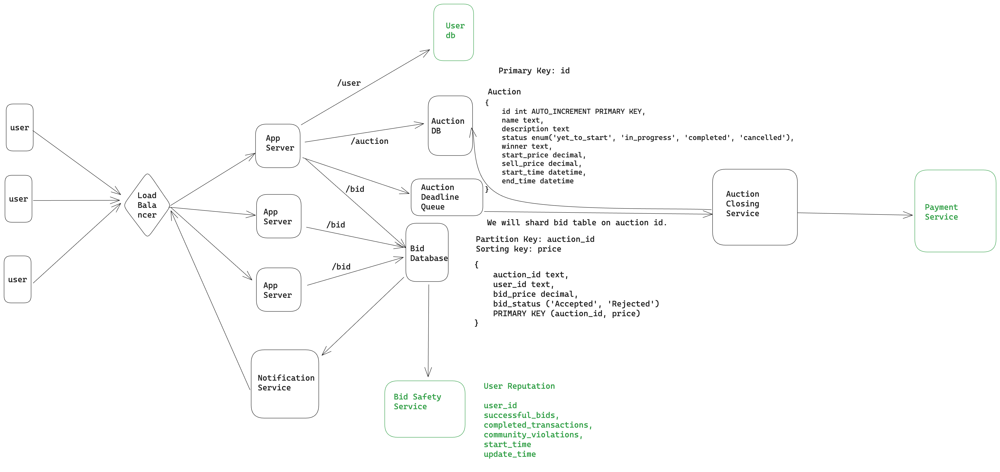

# Auction Service

## Overview
The Auction Service is a backend system designed to manage auctions and bids. It provides functionality for creating auctions, placing bids, retrieving auction information, and more.

Green components are natural extensions to build auction service.
However, we have not implemented them nor we have implemented load balancers and app servers.



## Features
- **Create Auction**: Allows users to create new auctions with specified parameters such as start time, end time, and starting price.
- **Place Bid**: Enables users to place bids on existing auctions.
- **Retrieve Auction Information**: Provides endpoints to retrieve information about auctions, including current highest bid, remaining time, and auction status.
- **Close Auction**: Automatically closes auctions when their end time is reached and determines the winning bid.

## Technologies Used
- **Java**: The primary programming language used for backend development.
- **Spring Boot**: Provides a framework for building robust and scalable Java applications.
- **Spring Data JPA**: Simplifies the implementation of data access layers by providing repository support.
- **JUnit 5** and **Mockito**: Used for unit testing to ensure the reliability and correctness of the application.
- **H2 Database**: Lightweight in-memory database used for development and testing purposes.
- **Swagger**: API documentation tool used to describe and visualize the endpoints of the Auction Service.

## Getting Started
### Prerequisites
- Java Development Kit (JDK) 8 or higher
- Apache Maven
- IDE (e.g., IntelliJ IDEA, Eclipse)

### Installation
1. Clone the repository:
```git clone https://github.com/jainvijay/auction.git```
2. Navigate to the project directory:
```cd auction```
3. Build the project using Maven:
```mvn clean install```

### Usage
1. Run the application:
```mvn spring-boot:run```
2. Access the API endpoints using tools like Postman or cURL.
3. To access the API documentation via Swagger, navigate to [http://localhost:8080/swagger-ui.html](http://localhost:8080/swagger-ui.html) in your web browser.

### Configuration
- The application uses an H2 in-memory database by default. You can configure the database settings in the `application.properties` file.
- Other configurations such as server port, logging, etc., can also be adjusted in the `application.properties` file.

## Testing
- Unit tests are located in the `src/test/java` directory and can be executed using the Maven command:
```mvn test```

## Contributing
Contributions are welcome! If you find any issues or have suggestions for improvements, please feel free to open an issue or submit a pull request.

## License
This project is licensed under the MIT License - see the [LICENSE](LICENSE) file for details.


